# E-Commerce Store — Terraform + Docker on AWS

> **Assignment:** Deploy a Multi-Service Node.js E-commerce Application Using Terraform and Docker  
> **Author:** Avinash Sain  
> **GitHub:** https://github.com/Avinashsain/E-CommerceStore

---

## Table of Contents

1. [Project Overview](#1-project-overview)
2. [Architecture](#2-architecture)
3. [Tech Stack](#3-tech-stack)
4. [Project Structure](#4-project-structure)
5. [Application Setup — Dockerfiles](#5-application-setup--dockerfiles)
6. [Infrastructure Provisioning — Terraform](#6-infrastructure-provisioning--terraform)
7. [API Documentation — Postman Collection](#7-api-documentation--postman-collection)
8. [Deployment — Step by Step](#8-deployment--step-by-step)
9. [Issues Faced & Fixes](#9-issues-faced--fixes)
10. [Screenshots](#10-screenshots)
11. [Verification](#11-verification)
12. [Cleanup](#12-cleanup)
13. [Marks Breakdown](#13-marks-breakdown)

---

## 1. Project Overview

A microservices-based e-commerce application with 5 Dockerized services deployed on AWS EC2 using Terraform for infrastructure provisioning.

| Service | Port | Description |
|---|---|---|
| Frontend | 3000 | React.js UI |
| User Service | 3001 | Auth, JWT, user profiles |
| Product Service | 3002 | Product catalog, categories, inventory |
| Cart Service | 3003 | Cart management, validation |
| Order Service | 3004 | Orders, payments, shipping |

---

## 2. Architecture

```
                        Internet
                            │
                            ▼
                 ┌─────────────────────┐
                 │   AWS Security Group │
                 │  Ports: 22, 80,      │
                 │  3000, 3001–3004     │
                 └─────────┬───────────┘
                            │
                            ▼
                 ┌─────────────────────┐
                 │   EC2 Instance       │
                 │   Ubuntu 22.04       │
                 │   t3.medium          │
                 │   ap-south-1a        │
                 └─────────┬───────────┘
                            │
              ┌─────────────┼─────────────┐
              │         Docker            │
              │   ecommerce-network       │
              │   (bridge)                │
              │                           │
     ┌────────┴──────────────────────┐    │
     │  frontend-service  :3000      │    │
     │  user-service      :3001      │    │
     │  product-service   :3002      │    │
     │  cart-service      :3003      │    │
     │  order-service     :3004      │    │
     └───────────────────────────────┘    │
              │                           │
              ▼                           │
     ┌─────────────────┐                  │
     │  MongoDB Atlas  │◄─────────────────┘
     │  (Cloud DB)     │
     └─────────────────┘

AWS Infrastructure:
  VPC (10.0.0.0/16)
    └── Public Subnet (10.0.1.0/24)
          └── Internet Gateway
                └── Route Table (0.0.0.0/0)

Terraform State:
  S3 Bucket: avinashsain65-terraform-state
  Region: us-east-1
  Locking: S3 native (use_lockfile=true)
```

---

## 3. Tech Stack

| Category | Technology |
|---|---|
| Infrastructure | Terraform >= 1.5.0 |
| Cloud Provider | AWS (ap-south-1 Mumbai) |
| Compute | EC2 t3.medium Ubuntu 22.04 |
| Networking | VPC, Subnet, IGW, Route Table, Security Group |
| Containerization | Docker, Docker Compose |
| Container Registry | DockerHub |
| Backend | Node.js, Express.js |
| Frontend | React.js |
| Database | MongoDB Atlas |
| State Management | AWS S3 + native locking |
| Auth | JWT |
| API Testing | Postman |

---

## 4. Project Structure

```
E-CommerceStore/
├── backend/
│   ├── user-service/          Node.js — Auth & users
│   │   ├── Dockerfile
│   │   ├── server.js
│   │   ├── models/
│   │   ├── routes/
│   │   └── package.json
│   ├── product-service/       Node.js — Products & categories
│   ├── cart-service/          Node.js — Cart management
│   └── order-service/         Node.js — Orders & payments
├── frontend/                  React.js — UI
│   ├── Dockerfile
│   ├── src/
│   └── package.json
├── postman/
│   ├── ECommerceStore.postman_collection.json
│   └── ECommerceStore.postman_environment.json
├── terraform/
│   ├── main.tf                VPC, EC2, Security Groups
│   ├── backend.tf             S3 remote state + locking
│   ├── variables.tf           All input variables
│   ├── outputs.tf             Public IP, URLs, SSH command
│   ├── user_data.sh           EC2 bootstrap script
│   ├── terraform.tfvars       ← gitignored (secrets)
│   └── terraform.tfvars.example
├── docker-compose.yml
├── .env                       ← gitignored
├── .gitignore
└── README.md
```

---

## 5. Application Setup — Dockerfiles

Each service has a `Dockerfile`. Example for `user-service`:

```dockerfile
FROM node:20-alpine
WORKDIR /app
COPY package*.json ./
RUN npm install
COPY . .
EXPOSE 3001
CMD ["node", "server.js"]
```

> **Issue faced:** Original Dockerfiles used `npm install --production` which skipped `devDependencies`. Since `nodemon` was in devDependencies, all containers crashed with `sh: nodemon: not found` (exit code 127).
>
> **Fix:** Changed to `npm install` in all Dockerfiles.

### Build for AMD64 (EC2 Platform)

> **Issue faced:** Mac M1/M2/M3 builds images for `linux/arm64` by default. EC2 runs `linux/amd64`. Docker pull failed with `no matching manifest for linux/amd64/v4`.
>
> **Fix:** Used `docker buildx` to build for the correct platform.

```bash
# Build and push for linux/amd64
docker buildx create --use --name multibuilder

for svc in user-service product-service cart-service order-service; do
  docker buildx build --platform linux/amd64 \
    -t avinashsain65/$svc:latest \
    --push ./backend/$svc
done

docker buildx build --platform linux/amd64 \
  -t avinashsain65/frontend:latest \
  --push ./frontend
```

### DockerHub Images

| Image | URL |
|---|---|
| user-service | `docker.io/avinashsain65/user-service:latest` |
| product-service | `docker.io/avinashsain65/product-service:latest` |
| cart-service | `docker.io/avinashsain65/cart-service:latest` |
| order-service | `docker.io/avinashsain65/order-service:latest` |
| frontend | `docker.io/avinashsain65/frontend:latest` |

---

## 6. Infrastructure Provisioning — Terraform

### backend.tf — Remote State

```hcl
terraform {
  required_version = ">= 1.5.0"

  required_providers {
    aws = {
      source  = "hashicorp/aws"
      version = "~> 6.0"
    }
  }

  backend "s3" {
    bucket       = "avinashsain65-terraform-state"
    key          = "ecommerce-store/terraform.tfstate"
    region       = "us-east-1"
    use_lockfile = true
    encrypt      = true
  }
}
```

### main.tf — AWS Resources

Resources created:

| Resource | ID | Details |
|---|---|---|
| `aws_vpc` | vpc-0af677ecf5be3ee3a | 10.0.0.0/16 |
| `aws_subnet` | subnet-05ccc71df59a18393 | 10.0.1.0/24, ap-south-1a |
| `aws_internet_gateway` | igw-08ababb76b9e84237 | Attached to VPC |
| `aws_route_table` | rtb-0eeddaead3d1464e2 | 0.0.0.0/0 → IGW |
| `aws_security_group` | sg-05862941850827abf | Ports 22,80,3000-3004 |
| `aws_key_pair` | ecommerce-store-key | SSH access |
| `aws_instance` | i-095c5bd1a20a45eab | t3.medium, Ubuntu 22.04 |

### Security Group Rules

| Rule | Port | Source | Purpose |
|---|---|---|---|
| Inbound | 22 | Your IP | SSH access |
| Inbound | 80 | 0.0.0.0/0 | HTTP |
| Inbound | 3000 | 0.0.0.0/0 | Frontend |
| Inbound | 3001-3004 | 0.0.0.0/0 | Backend services |
| Outbound | All | 0.0.0.0/0 | All traffic |

### user_data.sh — EC2 Bootstrap

The EC2 instance automatically on first boot:
1. Installs Docker CE
2. Clones repo from GitHub
3. Writes `docker-compose.yml` with secrets injected via Terraform `templatefile()`
4. Pulls all 5 images from DockerHub
5. Starts all containers with `docker compose up -d`

---

## 7. API Documentation — Postman Collection

The Postman collection and environment files are included in the `postman/` folder.

### Import into Postman

1. Open Postman → click **Import**
2. Import both files:
   - `postman/ECommerceStore.postman_collection.json`
   - `postman/ECommerceStore.postman_environment.json`
3. Select **"E-Commerce Store - Local"** from the environment dropdown

### API Endpoints

#### Auth (User Service — port 3001)

| Method | Endpoint | Description | Auth |
|---|---|---|---|
| POST | `/api/auth/register` | Register new user | No |
| POST | `/api/auth/login` | Login → returns JWT token | No |
| GET | `/api/users/profile` | Get user profile | Yes |
| PUT | `/api/users/profile` | Update profile | Yes |

#### Categories (Product Service — port 3002)

| Method | Endpoint | Description | Auth |
|---|---|---|---|
| GET | `/api/categories` | Get all categories | No |
| POST | `/api/categories` | Create category | Yes |
| PUT | `/api/categories/:id` | Update category | Yes |
| DELETE | `/api/categories/:id` | Delete category | Yes |

#### Products (Product Service — port 3002)

| Method | Endpoint | Description | Auth |
|---|---|---|---|
| GET | `/api/products` | Get all products | No |
| GET | `/api/products/:id` | Get single product | No |
| POST | `/api/products` | Create product | Yes |
| PUT | `/api/products/:id` | Update product | Yes |
| DELETE | `/api/products/:id` | Soft delete product | Yes |

#### Cart (Cart Service — port 3003)

| Method | Endpoint | Description | Auth |
|---|---|---|---|
| GET | `/api/cart/:userId` | Get user cart | Yes |
| POST | `/api/cart/:userId/add` | Add item to cart | Yes |
| PUT | `/api/cart/:userId/item/:productId` | Update cart item | Yes |
| DELETE | `/api/cart/:userId/item/:productId` | Remove item | Yes |
| DELETE | `/api/cart/:userId` | Clear cart | Yes |
| POST | `/api/cart/:userId/validate` | Validate cart stock | Yes |

#### Orders (Order Service — port 3004)

| Method | Endpoint | Description | Auth |
|---|---|---|---|
| POST | `/api/orders` | Create order from cart | Yes |
| GET | `/api/orders/user/:userId` | Get user orders | Yes |
| GET | `/api/orders/:id` | Get single order | Yes |
| PUT | `/api/orders/:id/status` | Update order status | Yes |
| DELETE | `/api/orders/:id` | Cancel order | Yes |

#### Payments (Order Service — port 3004)

| Method | Endpoint | Description | Auth |
|---|---|---|---|
| POST | `/api/payments/process` | Process payment | Yes |

### Postman Environment Variables

| Variable | Auto-set by | Description |
|---|---|---|
| `token` | Login/Register | JWT auth token |
| `user_id` | Login/Register | Current user ID |
| `category_id` | Create Category | Last created category |
| `product_id` | Create Product | Last created product |
| `order_id` | Create Order | Last created order |

### Correct Request Flow

```
1. Register / Login     → token + user_id auto-saved
2. Create Category      → category_id auto-saved
3. Create Product       → product_id auto-saved
4. Add to Cart          → uses user_id + product_id
5. Create Order         → order_id auto-saved
6. Process Payment      → uses order_id
```

### Sample Product Request Body

```json
{
  "name": "iPhone 15 Pro",
  "description": "Latest Apple iPhone with A17 Pro chip",
  "price": 999,
  "category": "{{category_id}}",
  "brand": "Apple",
  "stock": 50,
  "images": [{ "url": "https://placehold.co/400x400/000000/FFFFFF?text=iPhone+15+Pro", "alt": "iPhone 15 Pro" }],
  "inventory": { "sku": "APPLE-IP15P-001", "quantity": 50 }
}
```

---

## 8. Deployment — Step by Step

### Prerequisites

```bash
# Install required tools
brew install terraform awscli

# Configure AWS
aws configure
# Enter: Access Key, Secret Key, Region (ap-south-1), Output (json)

# Generate SSH key
ssh-keygen -t rsa -b 4096 -f ~/.ssh/id_rsa
```

### Step 1 — Create S3 bucket for Terraform state

> **Issue faced:** `terraform init` failed with `S3 bucket does not exist`. The bucket must exist before Terraform can use it as backend.
>
> **Fix:** Create bucket manually via AWS CLI before `terraform init`.

```bash
aws s3api create-bucket \
  --bucket avinashsain65-terraform-state \
  --region us-east-1

aws s3api put-bucket-versioning \
  --bucket avinashsain65-terraform-state \
  --versioning-configuration Status=Enabled
```

### Step 2 — Configure variables

```bash
cd terraform
cp terraform.tfvars.example terraform.tfvars
# Edit terraform.tfvars with your values — NEVER commit this file
```

### Step 3 — Deploy infrastructure

```bash
terraform init
terraform validate
terraform plan
terraform apply
```

### Step 4 — View outputs

```bash
terraform output
```

```
cart_service_url    = "http://98.81.52.9:3003"
ec2_instance_id     = "i-095c5bd1a20a45eab"
frontend_url        = "http://98.81.52.9:3000"
order_service_url   = "http://98.81.52.9:3004"
product_service_url = "http://98.81.52.9:3002"
public_dns          = "ec2-3-237-240-98.compute-1.amazonaws.com"
public_ip           = "98.81.52.9"
security_group_id   = "sg-0f0dc4191ceca6f5c"
ssh_command         = "ssh -i ~/.ssh/id_rsa ubuntu@98.81.52.9"
subnet_id           = "subnet-0abd1d7edd2b30962"
user_service_url    = "http://98.81.52.9:3001"
vpc_id              = "vpc-0d527bbc7acbd989c"
```

### Step 5 — SSH and verify

```bash
ssh -i ~/.ssh/id_rsa ubuntu@98.81.52.9

# Check bootstrap log
cat /var/log/user-data.log

# Check containers
docker ps
```

---

## 9. Issues Faced & Fixes

| # | Issue | Error | Fix |
|---|---|---|---|
| 1 | Docker image pull timeout | `TLS handshake timeout` | Added DNS `8.8.8.8` to Docker Desktop settings |
| 2 | MongoDB Atlas connection refused | `connect ECONNREFUSED localhost:27017` | `.env` files inside service folders were overriding docker-compose env vars. Deleted local `.env` files |
| 3 | `nodemon` not found | `sh: nodemon: not found (exit 127)` | Changed `npm install --production` to `npm install` in all Dockerfiles |
| 4 | Wrong platform images | `no matching manifest for linux/amd64/v4` | Used `docker buildx build --platform linux/amd64` on Mac M1 |
| 5 | S3 bucket not found on `terraform init` | `S3 bucket does not exist` | Must create S3 bucket manually before `terraform init` |
| 6 | S3 bucket already exists | `BucketAlreadyExists` | Ran `terraform import aws_s3_bucket.terraform_state avinashsain65-terraform-state` |
| 7 | Duplicate key pair | `InvalidKeyPair.Duplicate` | Ran `aws ec2 delete-key-pair --key-name ecommerce-store-key` then reapplied |
| 8 | AMI not found | `Your query returned no results` | Fixed AMI filter from strict to wildcard: `ubuntu-*22.04*amd64*` |
| 9 | Variable in backend block | Terraform parse error | Backend blocks don't support variable interpolation — hardcoded bucket name |
| 10 | Docker permission denied on EC2 | `permission denied /var/run/docker.sock` | Ran `newgrp docker` after `usermod -aG docker ubuntu` |
| 11 | Wrong frontend IP (private IP) | `100.58.x.x` in docker-compose | Fetched real public IP from AWS metadata: `curl http://169.254.169.254/latest/meta-data/public-ipv4` |
| 12 | Credentials exposed in GitHub | GitGuardian alert | Moved all secrets to `terraform.tfvars` (gitignored), removed from git history with `git filter-branch` |
| 13 | `declare -A` error in build script | `invalid option` on Mac zsh | Mac uses `zsh` not `bash` — replaced associative array with individual variables |
| 14 | Order validation failed | `orderNumber is required` | Two separate `pre('save')` hooks caused race condition — merged into single async hook, removed `required: true` from `orderNumber` |

---

## 10. Screenshots

### 10.1 Terraform Apply Success
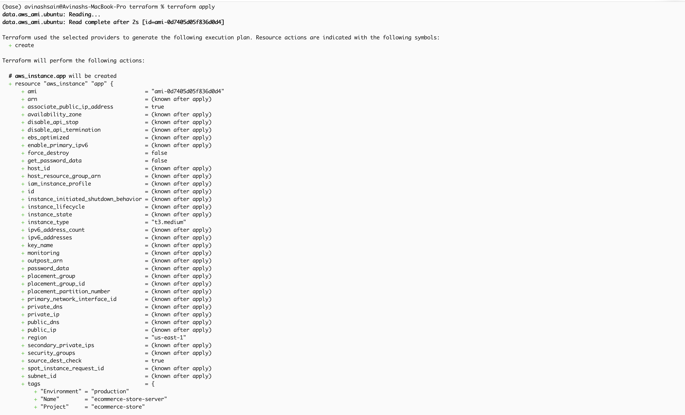
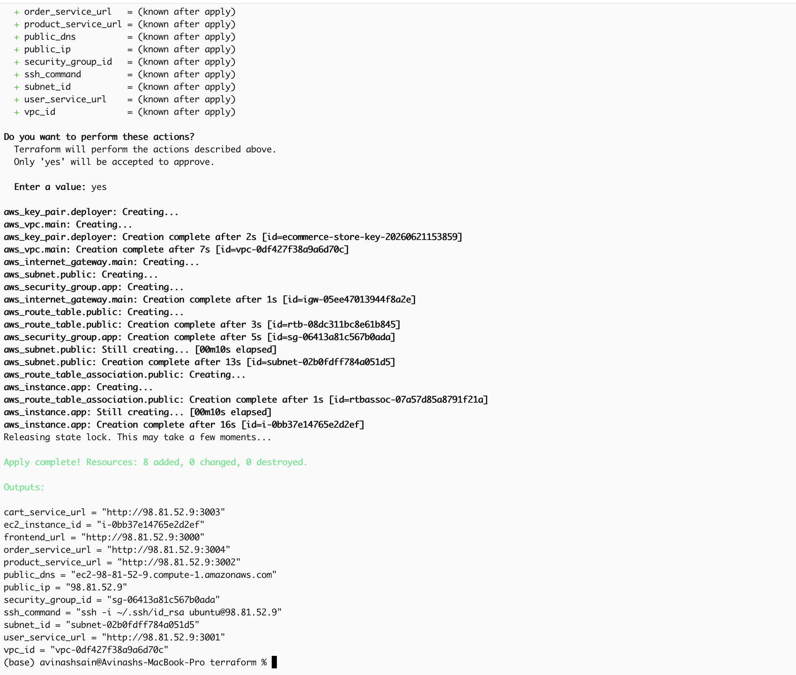

### 10.2 Terraform Outputs
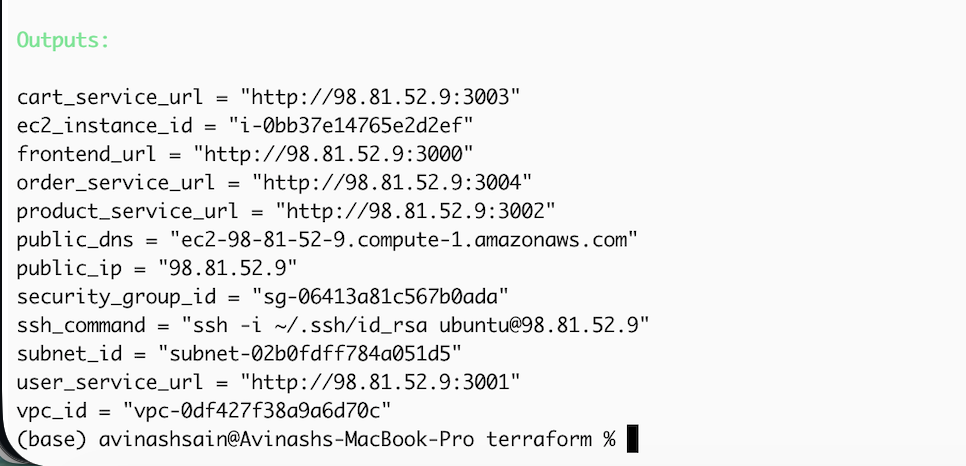

### 10.3 EC2 Instance Running
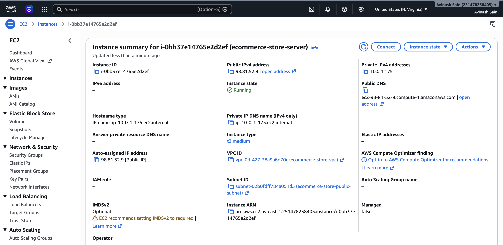

### 10.4 VPC and Networking
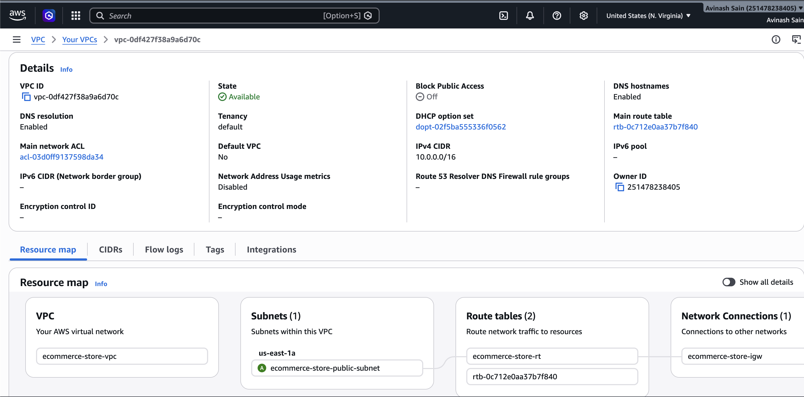

### 10.5 Security Group Rules
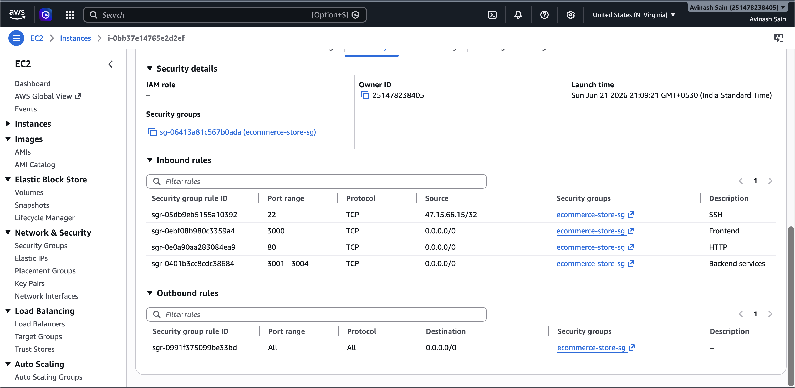

### 10.6 Docker Containers Running on EC2
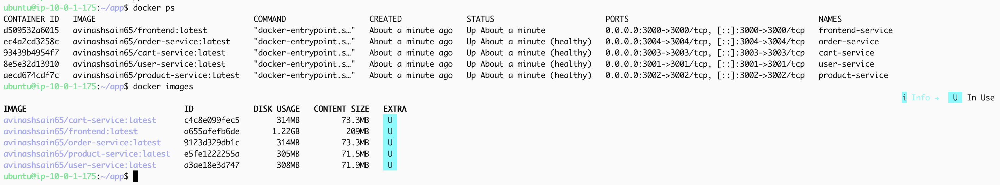

### 10.7 Frontend Accessible via Public IP
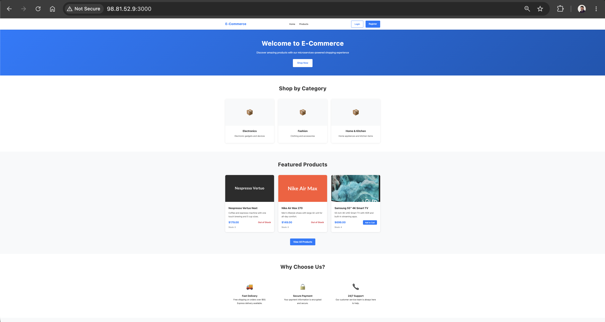
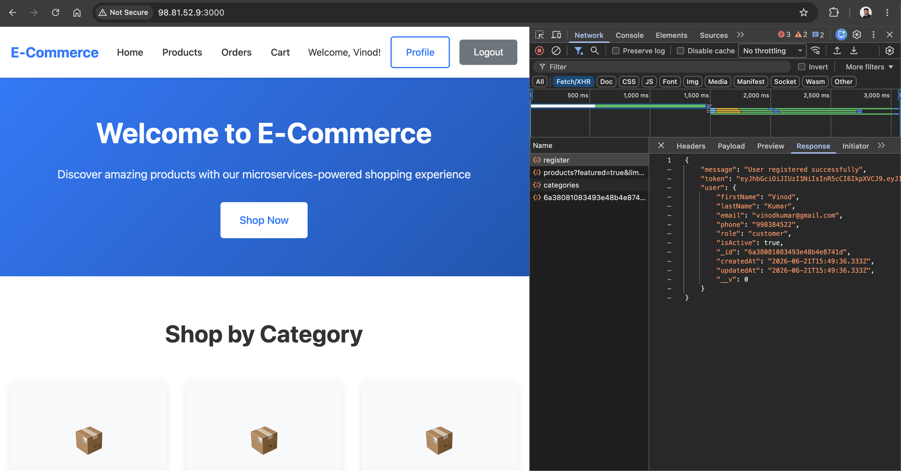
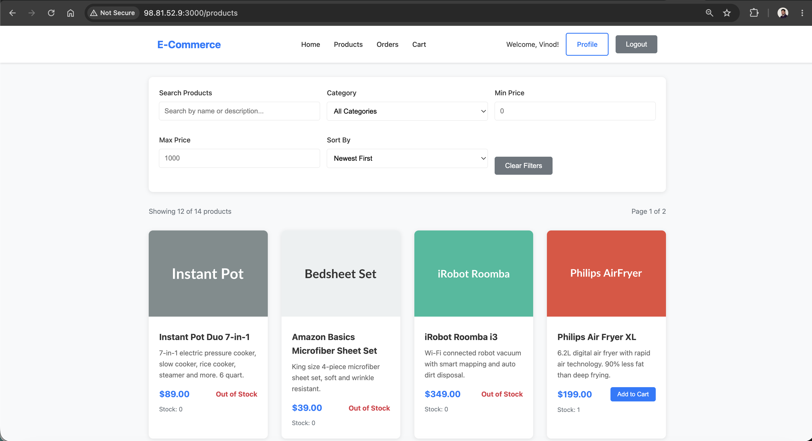
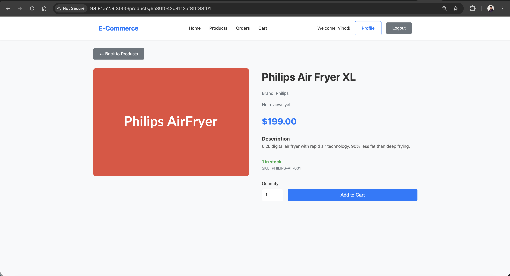
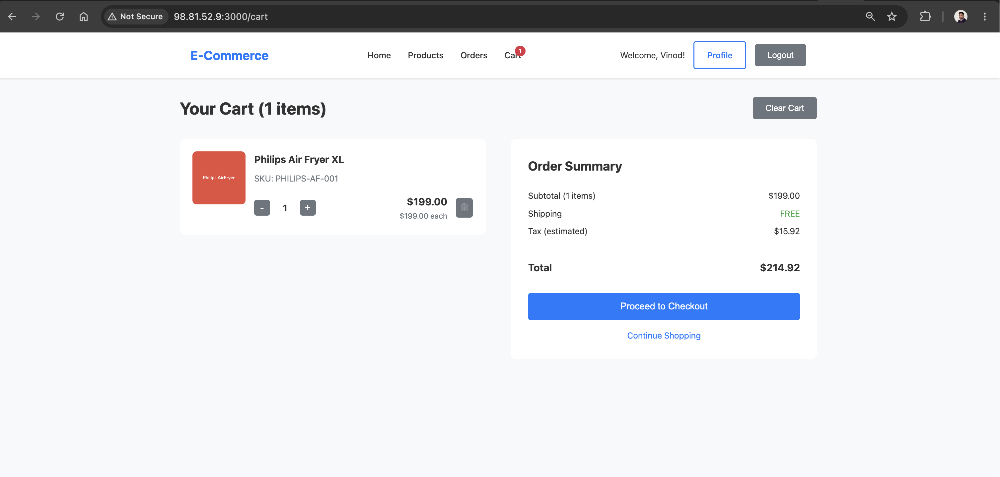
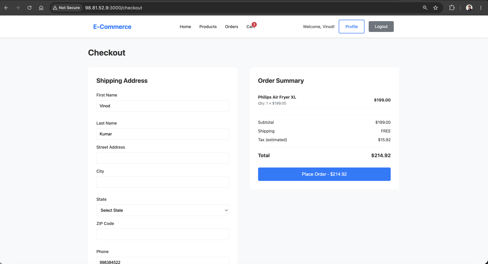
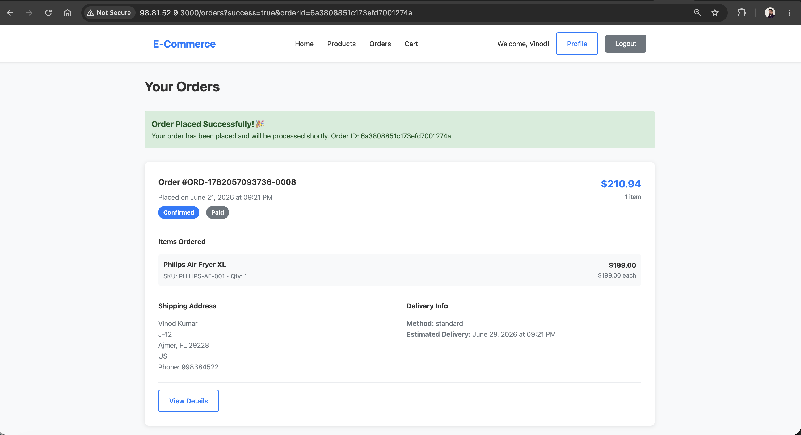

### 10.8 DockerHub Images
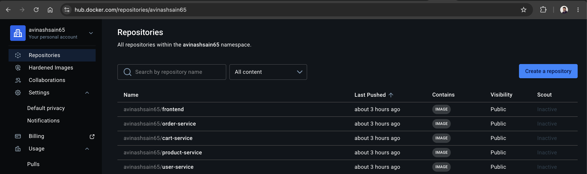

### 10.9 S3 Terraform State
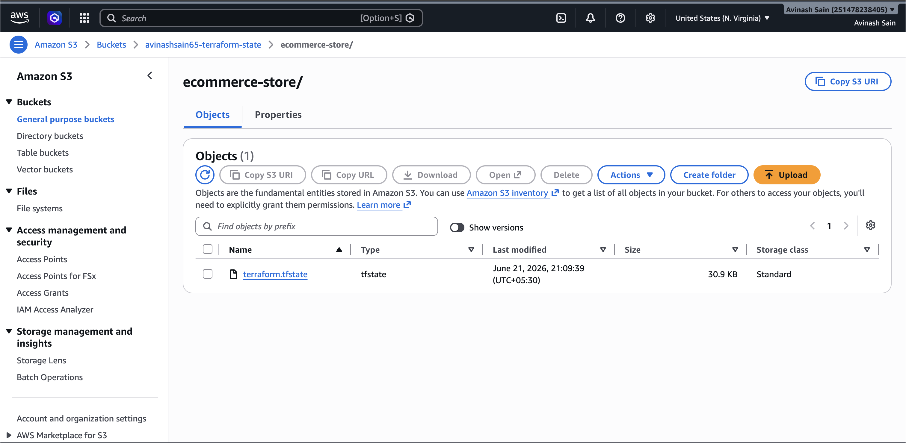

### 10.10 Postman Collection
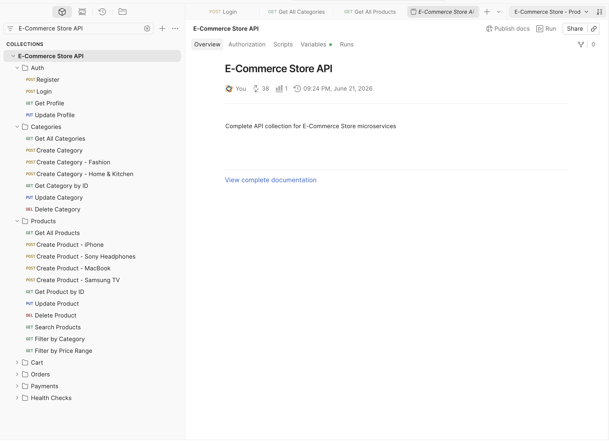

### 10.11 Postman API Test — Login
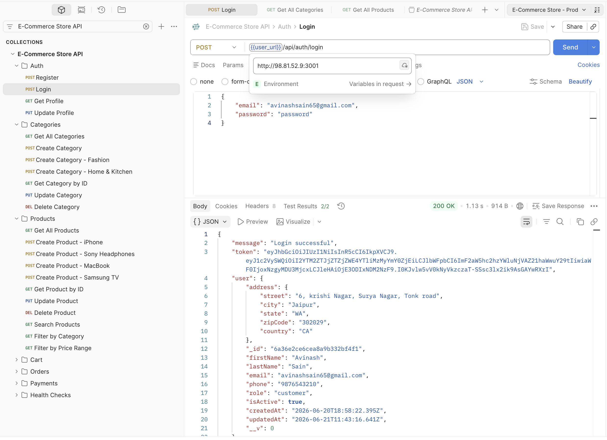

### 10.12 Postman API Test — Create Product
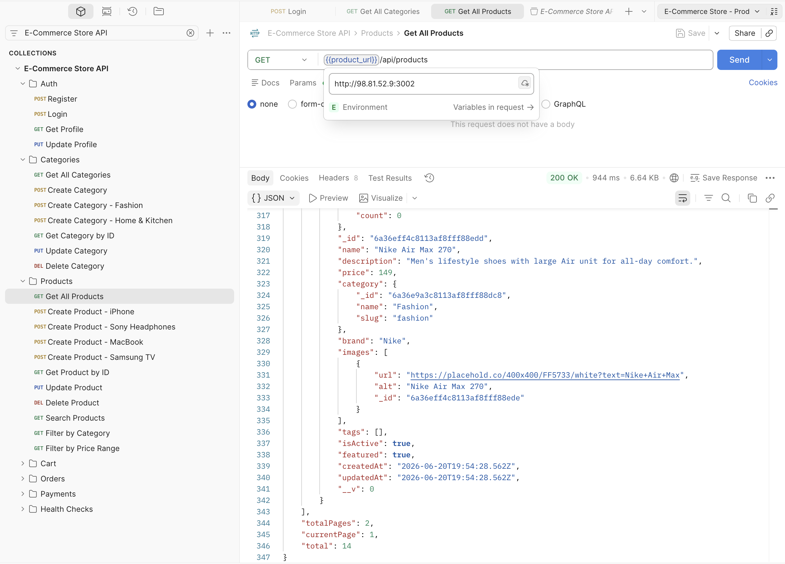

---

## 11. Verification

### Test all services from terminal

```bash
# Frontend
curl http://98.81.52.9:3000
# Expected: HTML page "Frontend is Live"

# User Service
curl http://98.81.52.9:3001/health
# Expected: {"status":"ok","service":"user-service"}

# Product Service
curl http://98.81.52.9:3002/health
# Expected: {"status":"ok","service":"product-service"}

# Cart Service
curl http://98.81.52.9:3003/health
# Expected: {"status":"ok","service":"cart-service"}

# Order Service
curl http://98.81.52.9:3004/health
# Expected: {"status":"ok","service":"order-service"}
```

### Check containers on EC2

```bash
ssh -i ~/.ssh/id_rsa ubuntu@98.81.52.9
docker ps
```

Expected output:
```
CONTAINER ID  IMAGE                              STATUS         PORTS                   NAMES
xxxx          avinashsain65/frontend:latest      Up 5 minutes   0.0.0.0:3000->3000/tcp  frontend-service
xxxx          avinashsain65/user-service:latest  Up 5 minutes   0.0.0.0:3001->3001/tcp  user-service
xxxx          avinashsain65/product-service      Up 5 minutes   0.0.0.0:3002->3002/tcp  product-service
xxxx          avinashsain65/cart-service         Up 5 minutes   0.0.0.0:3003->3003/tcp  cart-service
xxxx          avinashsain65/order-service        Up 5 minutes   0.0.0.0:3004->3004/tcp  order-service
```

---

## 12. Cleanup

```bash
# Destroy all AWS resources
cd terraform
terraform destroy

# Delete S3 bucket (manually — kept outside Terraform)
aws s3 rm s3://avinashsain65-terraform-state --recursive
aws s3api delete-bucket --bucket avinashsain65-terraform-state
```
---

## Security Notes

- All secrets stored in `terraform.tfvars` — gitignored, never committed
- MongoDB Atlas credentials rotated after accidental exposure
- Git history cleaned with `git filter-branch`
- S3 state bucket has encryption and public access blocked
- SSH access restricted to specific IP via `allowed_ssh_cidr`

---

*Deployed with Terraform + Docker on AWS EC2 | MongoDB Atlas | DockerHub*